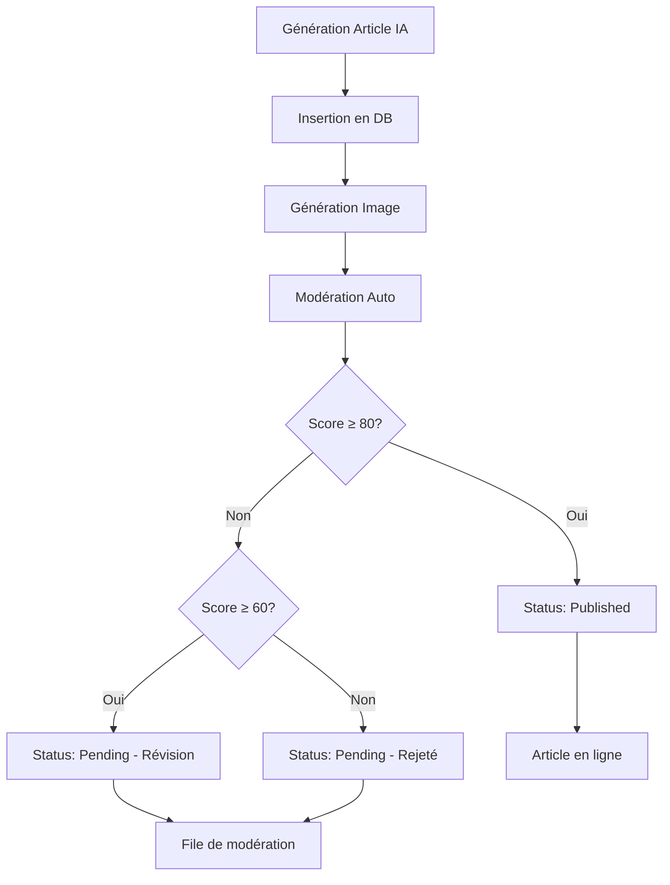

# 🔍 Système de Modération Automatique des Articles IA

## Vue d'ensemble

Le système de modération automatique analyse et valide tous les articles générés par IA avant leur publication. Il garantit la qualité, la conformité SEO et la sécurité du contenu.

## Fonctionnalités

### 1. Analyse Automatique
- ✅ **Qualité du contenu** : Vérification de la longueur, structure et cohérence
- ✅ **SEO** : Validation des méta-données, mots-clés et optimisation
- ✅ **Sécurité** : Détection de contenu suspect ou inapproprié
- ✅ **Lisibilité** : Analyse de la structure (paragraphes, sous-titres)

### 2. Scoring Intelligent
Chaque article reçoit un score de 0 à 100 basé sur :

| Critère | Poids | Description |
|---------|-------|-------------|
| Longueur du contenu | 20 pts | Minimum 500 caractères recommandés |
| Titre optimisé | 10 pts | Entre 20 et 70 caractères |
| Méta-données SEO | 15 pts | Meta title et description |
| Mots-clés | 10 pts | Au moins 3 mots-clés pertinents |
| Excerpt | 5 pts | Au moins 100 caractères |
| Image featured | 10 pts | Image mise en avant présente |
| Contenu suspect | -30 pts | Détection de spam/commercial |
| Structure | 10 pts | Sous-titres et paragraphes |

### 3. États de Modération

#### ✅ **Approuvé** (score ≥ 80)
- Article de haute qualité
- Publié automatiquement si `auto_publish = true`
- Aucune action requise

#### ⚠️ **Nécessite une révision** (60 ≤ score < 80)
- Qualité acceptable mais améliorations possibles
- Statut: `pending`
- Validation manuelle recommandée

#### ❌ **Rejeté** (score < 60)
- Qualité insuffisante
- Statut: `pending`
- Révision manuelle obligatoire

## Architecture Technique

### Edge Functions

#### `blog-ai-moderation`
```typescript
POST /functions/v1/blog-ai-moderation
{
  "post_id": "uuid"
}
```

**Réponse :**
```json
{
  "success": true,
  "moderation": {
    "score": 85,
    "status": "approved",
    "issues": [],
    "recommendations": ["Ajouter plus de mots-clés"]
  },
  "new_status": "published"
}
```

### Workflow Automatique



## Interfaces Utilisateur

### 1. Dashboard Analytics IA
**Route :** `/admin?tab=blog&blogTab=ai-analytics`

Affiche :
- Comparaison performance IA vs Manuel
- Distribution par modèle IA
- Métriques SEO
- Statistiques de modération

### 2. File de Modération
**Route :** `/admin?tab=blog&blogTab=moderation`

Fonctionnalités :
- Liste des articles en attente
- Bouton "Analyser" pour re-modération
- Actions : Approuver / Rejeter
- Prévisualisation des articles

### 3. Configuration Automatisation
**Route :** `/admin?tab=blog&blogTab=automation`

Affiche :
- Statut de la modération automatique
- Statistiques en temps réel
- Configuration des règles

## Utilisation

### Test Manuel
```typescript
// Via l'interface admin
1. Aller à /admin?tab=blog&blogTab=automation
2. Cliquer sur "⚡ Tester une génération maintenant"
3. L'article sera automatiquement modéré après génération
```

### Modération Manuelle
```typescript
// Via API
const { data } = await supabase.functions.invoke('blog-ai-moderation', {
  body: { post_id: 'article-uuid' }
});
```

### Workflow Automatisé
```sql
-- Les cron jobs appellent automatiquement la modération
-- Configuration dans blog-ai-generator/index.ts
-- Aucune intervention nécessaire
```

## Règles de Modération

### Contenu Suspect Détecté
Patterns automatiquement détectés :
- Termes commerciaux agressifs (viagra, casino, lottery)
- Call-to-action excessifs (click here, buy now)
- Symboles spammy ($$$, !!!)

### Recommandations Générées
Le système fournit des suggestions d'amélioration :
- "Augmenter la longueur à 1000+ caractères"
- "Ajouter au moins 5 mots-clés pertinents"
- "Structurer avec des sous-titres (##)"
- "Ajouter une image mise en avant"

## Monitoring et Analytics

### Métriques Clés
- **Taux d'approbation automatique** : % articles score ≥ 80
- **Articles en attente** : Nombre de pending
- **Performance IA vs Manuel** : Comparaison engagement
- **Optimisation SEO** : % articles avec meta complètes

### Tableaux de Bord
1. **Analytics IA** : Performance et métriques détaillées
2. **File de modération** : Gestion des articles en attente
3. **Automation Settings** : Statut et configuration

## Sécurité

- ✅ Vérification admin via `has_role` RPC
- ✅ Service role key pour appels internes
- ✅ Validation des entrées
- ✅ Logs détaillés des modérations

## Maintenance

### Logs
```bash
# Consulter les logs de modération
supabase functions logs blog-ai-moderation
```

### Réglages
Modifier les seuils dans `blog-ai-moderation/index.ts` :
```typescript
// Seuil d'approbation automatique
if (score >= 80 && issues.length === 0) {
  status = 'approved';
}
```

## Évolutions Futures

- [ ] Machine Learning pour améliorer la précision
- [ ] Détection avancée de contenu sensible
- [ ] Analyse de sentiment et ton
- [ ] Vérification des faits avec sources
- [ ] Suggestions de corrections automatiques
- [ ] Intégration avec outils de plagiat

## Support

Pour toute question ou problème :
- Consulter les logs : `/admin?tab=monitoring`
- Analytics IA : `/admin?tab=blog&blogTab=ai-analytics`
- Documentation : [docs.topreparateurs.fr](https://docs.topreparateurs.fr)
