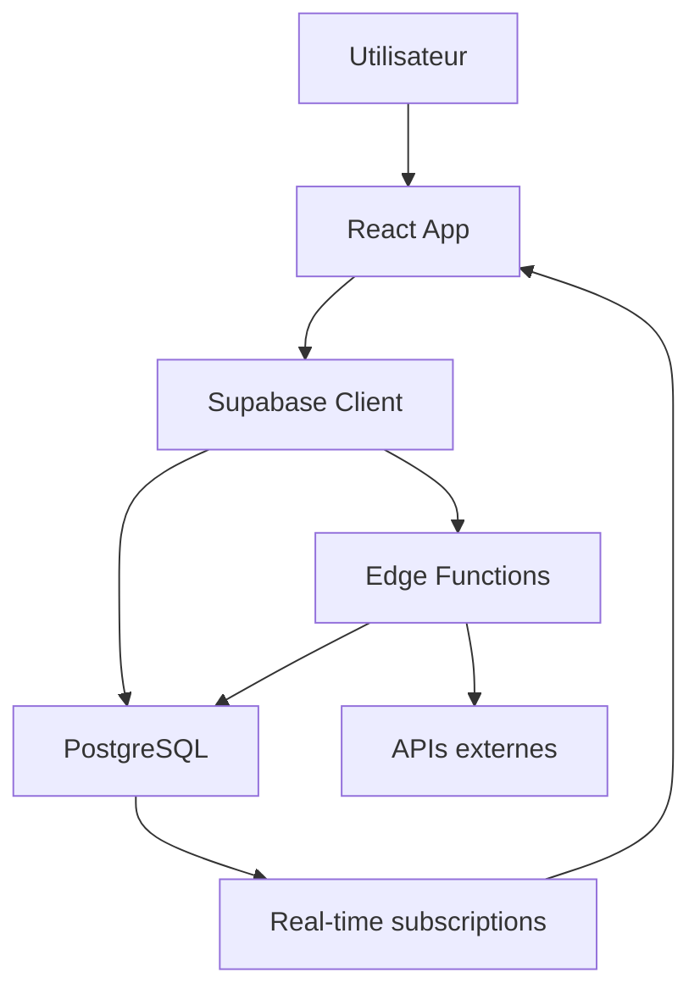
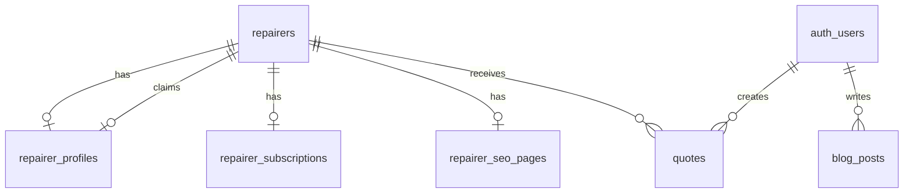

# Documentation Technique - TopRéparateurs.fr

## Table des matières

1. [Vue d'ensemble](#vue-densemble)
2. [Architecture technique](#architecture-technique)
3. [Fonctionnalités principales](#fonctionnalités-principales)
4. [Modules et composants](#modules-et-composants)
5. [Base de données](#base-de-données)
6. [APIs et intégrations](#apis-et-intégrations)
7. [Sécurité et conformité](#sécurité-et-conformité)
8. [Déploiement](#déploiement)

---

## Vue d'ensemble

**TopRéparateurs.fr** est une plateforme SaaS B2B2C qui met en relation les particuliers avec des réparateurs de smartphones qualifiés en France.

### Stack technologique

- **Frontend** : React 18, TypeScript, Tailwind CSS, Vite
- **Backend** : Supabase (PostgreSQL, Auth, Real-time, Edge Functions)
- **IA** : Mistral AI, DeepSeek pour diagnostic et classification
- **Cartographie** : Mapbox GL JS, Leaflet, OpenStreetMap
- **Scraping** : Firecrawl, Apify, Serper API
- **Paiement** : Stripe (abonnements, webhooks)
- **Analytics** : Système propriétaire temps réel
- **Hosting** : Lovable Cloud (auto-scaling)

---

## Architecture technique

### Structure du projet

```
topreparateurs/
├── src/
│   ├── components/          # Composants React réutilisables
│   │   ├── admin/          # Interface administration
│   │   ├── search/         # Recherche et carte
│   │   ├── profile/        # Profils réparateurs
│   │   ├── seo/            # Composants SEO
│   │   └── ui/             # Design system (shadcn)
│   ├── pages/              # Pages principales
│   ├── hooks/              # Hooks React personnalisés
│   ├── services/           # Services métier
│   ├── integrations/       # Intégrations externes
│   └── config/             # Configuration
├── supabase/
│   ├── functions/          # Edge Functions serverless
│   └── migrations/         # Migrations SQL
├── docs/                   # Documentation
└── public/                 # Assets statiques
```

### Flux de données



---

## Fonctionnalités principales

### 1. Recherche géolocalisée de réparateurs

**Composants** :
- `src/pages/SearchPage.tsx` : Page principale de recherche
- `src/components/search/SearchMap.tsx` : Carte interactive Mapbox
- `src/components/search/RepairerCard.tsx` : Carte réparateur

**Fonctionnalités** :
- Recherche par ville, département ou code postal
- Géolocalisation automatique utilisateur
- Affichage carte + liste
- Filtres avancés (services, marques, prix)
- Tri par distance, note, prix

**Technologies** :
- Mapbox GL JS pour la carte interactive
- PostGIS pour les calculs de distance
- Geocoding API pour la conversion adresse → coordonnées

### 2. Scraping automatisé de réparateurs

**Edge Functions** :
- `supabase/functions/apify-scraping/` : Scraping via Apify
- `supabase/functions/serper-search/` : Recherche Google via Serper
- `supabase/functions/multi-ai-pipeline/` : Classification IA

**Processus** :
1. Scraping quotidien automatique (Google Maps, Pages Jaunes)
2. Extraction données (nom, adresse, téléphone, services)
3. Géocodage automatique
4. Vérification SIRET via API Pappers
5. Classification IA des services
6. Insertion base de données avec statut `is_verified: false`

**Services** :
- `src/services/scraping/ApiManager.ts` : Gestion fallback APIs
- `src/hooks/scraping/useScrapingResults.ts` : Hook données scraping

### 3. Gestion des profils réparateurs

**Types de profils** :
- **Non revendiqué** : Créé automatiquement par scraping (mode simplifié)
- **Revendiqué gratuit** : Réparateur inscrit, profil de base
- **Revendiqué payant** : Profil complet + page SEO locale

**Composants** :
- `src/pages/RepairerProfilePage.tsx` : Profil public
- `src/components/profile/RepairerPublicProfile.tsx` : Profil complet
- `src/components/profile/ClientSimplifiedProfile.tsx` : Profil simplifié
- `src/components/profile/RepairerDashboard.tsx` : Dashboard réparateur

**Tables** :
- `repairers` : Données de base (nom, adresse, coordonnées)
- `repairer_profiles` : Données enrichies (description, horaires, certifications)
- `repairer_subscriptions` : Abonnements Stripe

### 4. Système d'abonnements et paiements

**Plans disponibles** :
- **Gratuit** : Profil de base, 5 devis/mois
- **Standard** (29€/mois) : Devis illimités, priorité recherche
- **Premium** (59€/mois) : Page SEO locale, analytics avancées
- **Enterprise** (99€/mois) : Modules POS/E-commerce, support prioritaire

**Intégration Stripe** :
- `supabase/functions/stripe-webhook/` : Gestion webhooks
- Événements gérés : `checkout.session.completed`, `customer.subscription.updated`, `customer.subscription.deleted`
- Génération automatique page SEO lors souscription payante

**Tables** :
- `repairer_subscriptions` : Suivi abonnements actifs
- `subscription_invoices` : Historique facturation

### 5. Pages SEO locales automatiques

**Système de génération** :
- Déclenchement automatique lors souscription plan payant
- Template HTML personnalisé par réparateur et ville
- Structured Data Schema.org (LocalBusiness)
- Meta tags optimisés SEO
- Sitemap automatique

**Edge Function** :
- `supabase/functions/generate-repairer-seo-page/` : Génération page SEO

**Structure URL** :
- Format : `topreparateurs.fr/{ville}/{nom-reparateur}`
- Exemple : `topreparateurs.fr/chaumont/abc-mobile`

**Composants** :
- `src/pages/RepairerSeoPage.tsx` : Page SEO publique
- `src/components/admin/RepairerSeoPanel.tsx` : Gestion admin
- `src/services/repairerSeoService.ts` : Service métier

**Table** :
- `repairer_seo_pages` : Pages SEO générées

**Données incluses** :
- Title, meta description, H1, H2
- Services proposés
- Marques réparées
- Coordonnées et localisation
- Horaires d'ouverture
- Lien Google Maps
- JSON-LD Structured Data

### 6. Interface d'administration

**Panels disponibles** :

#### Dashboard principal
- Vue d'ensemble KPIs
- Graphiques temps réel
- Alertes système

#### Gestion réparateurs
- Validation profils
- Modération contenus
- Gestion abonnements

#### Scraping
- Lancement scraping manuel
- Suivi logs temps réel
- Validation données scrapées
- Statistiques scraping

#### SEO
- **SEO Local** : Génération pages par ville
- **Pages SEO Réparateurs** : Gestion pages automatiques (NEW)
- **Outils SEO** : Configuration Mapbox, sitemap
- **Monitoring SEO** : Suivi positions Google
- **Générateur Contenu** : Articles IA

#### Analytics
- Visiteurs temps réel
- Conversions
- Performances pages
- Heatmaps

#### Shopify (modules)
- Gestion catalogue pièces
- Commandes
- Stock

#### Configuration
- Plans et tarifs
- Features flags
- Codes promo
- API keys

**Composants principaux** :
- `src/pages/AdminPage.tsx` : Container principal
- `src/components/admin/modern/HorizontalAdminNav.tsx` : Navigation
- `src/components/admin/RepairerSeoPanel.tsx` : Panel SEO réparateurs
- `src/components/admin/SeoToolsPanel.tsx` : Outils SEO
- `src/components/admin/scraping/ScrapingDashboard.tsx` : Dashboard scraping

### 7. Système de devis et rendez-vous

**Workflow** :
1. Client demande devis via profil réparateur
2. Notification temps réel au réparateur
3. Réparateur répond avec tarif et délai
4. Client accepte/refuse
5. Si accepté → Prise de RDV
6. Confirmation par email/SMS

**Tables** :
- `quotes` : Demandes de devis
- `appointments` : Rendez-vous planifiés
- `quote_messages` : Messagerie devis

**Composants** :
- `src/components/admin/quotes/RealTimeQuotesManager.tsx` : Gestion devis
- `src/pages/QuoteRequestPage.tsx` : Formulaire demande devis

### 8. Blog et génération de contenu IA

**Fonctionnalités** :
- Génération automatique articles SEO
- Templates prédéfinis (guide, comparatif, tuto)
- Optimisation mots-clés
- Publication programmée
- Intégration Schema.org Article

**Composants** :
- `src/components/blog/admin/BlogAIGenerator.tsx` : Générateur IA
- `src/components/blog/BlogEditor.tsx` : Éditeur WYSIWYG
- `src/pages/BlogPage.tsx` : Liste articles

**Table** :
- `blog_posts` : Articles publiés

### 9. Analytics temps réel

**Système propriétaire** :
- Tracking événements personnalisés
- Segmentation visiteurs
- Conversion funnels
- Performances pages

**Edge Functions** :
- `supabase/functions/analytics-track/` : Tracking événements

**Tables** :
- `analytics_events` : Événements trackés
- `analytics_sessions` : Sessions utilisateurs
- `analytics_page_views` : Vues pages

**Composants** :
- `src/components/admin/analytics/AnalyticsDashboard.tsx` : Dashboard analytics

### 10. Système de notifications

**Types de notifications** :
- Nouveau devis reçu
- Devis accepté/refusé
- Rappel RDV
- Expiration abonnement
- Nouveau scraping terminé

**Technologies** :
- Real-time subscriptions Supabase
- Toast notifications (sonner)
- Emails transactionnels (Resend)

**Table** :
- `notifications` : Historique notifications

---

## Base de données

### Tables principales

#### `repairers`
Données de base des réparateurs (scrapés ou revendiqués).

```sql
id: UUID PRIMARY KEY
name: TEXT
address: TEXT
city: TEXT
postal_code: TEXT
department: TEXT
latitude: DECIMAL
longitude: DECIMAL
phone: TEXT
email: TEXT
website: TEXT
services: TEXT[]
price_range: TEXT
rating: DECIMAL
is_verified: BOOLEAN
source: TEXT (scraping, manual, claim)
user_id: UUID (si revendiqué)
scraped_at: TIMESTAMP
```

#### `repairer_profiles`
Profils enrichis des réparateurs revendiqués.

```sql
id: UUID PRIMARY KEY
repairer_id: UUID REFERENCES repairers
user_id: UUID REFERENCES auth.users
description: TEXT
siret_number: TEXT
certifications: JSONB
opening_hours: JSONB
photos: TEXT[]
years_experience: INTEGER
claimed_at: TIMESTAMP
```

#### `repairer_subscriptions`
Abonnements Stripe des réparateurs.

```sql
id: UUID PRIMARY KEY
repairer_id: UUID REFERENCES repairers
user_id: UUID REFERENCES auth.users
stripe_customer_id: TEXT
stripe_subscription_id: TEXT
plan_name: TEXT (free, standard, premium, enterprise)
status: TEXT (active, canceled, past_due)
current_period_start: TIMESTAMP
current_period_end: TIMESTAMP
```

#### `repairer_seo_pages`
Pages SEO locales générées automatiquement.

```sql
id: UUID PRIMARY KEY
repairer_id: UUID REFERENCES repairers
slug: TEXT UNIQUE (ville-nom-reparateur)
url_path: TEXT (/ville/nom-reparateur)
title: TEXT
meta_description: TEXT
h1: TEXT
content_intro: TEXT
services_list: JSONB
structured_data: JSONB
is_published: BOOLEAN
page_views: INTEGER
last_indexed_at: TIMESTAMP
created_at: TIMESTAMP
```

#### `quotes`
Demandes de devis clients.

```sql
id: UUID PRIMARY KEY
client_id: UUID REFERENCES auth.users
repairer_id: UUID REFERENCES repairers
device_brand: TEXT
device_model: TEXT
problem_description: TEXT
status: TEXT (pending, responded, accepted, declined)
quoted_price: DECIMAL
estimated_duration: TEXT
```

#### `blog_posts`
Articles de blog générés ou manuels.

```sql
id: UUID PRIMARY KEY
title: TEXT
slug: TEXT UNIQUE
content: TEXT
excerpt: TEXT
featured_image: TEXT
author_id: UUID
category: TEXT
tags: TEXT[]
seo_title: TEXT
seo_description: TEXT
published_at: TIMESTAMP
```

#### `analytics_events`
Événements trackés pour analytics.

```sql
id: UUID PRIMARY KEY
event_name: TEXT
user_id: UUID
session_id: UUID
properties: JSONB
page_url: TEXT
referrer: TEXT
device_type: TEXT
created_at: TIMESTAMP
```

### Relations principales



---

## APIs et intégrations

### APIs externes

#### Mapbox
- **Usage** : Carte interactive, géocodage
- **Endpoints** :
  - Geocoding API : Conversion adresse → coordonnées
  - Directions API : Calcul itinéraires
  - Static Images API : Captures cartes statiques
- **Configuration** : Token public dans `.env`

#### Stripe
- **Usage** : Paiements, abonnements, facturation
- **Webhooks** :
  - `checkout.session.completed` : Nouveau paiement
  - `customer.subscription.updated` : Changement abonnement
  - `customer.subscription.deleted` : Annulation
- **Configuration** : Secret key dans Supabase secrets

#### Apify
- **Usage** : Scraping Google Maps
- **Actors utilisés** :
  - Google Maps Scraper
  - Google Search Results Scraper
- **Configuration** : API key dans Supabase secrets

#### Serper
- **Usage** : Recherches Google programmatiques
- **Endpoints** :
  - Search API : Résultats de recherche
  - Places API : Informations établissements
- **Configuration** : API key dans Supabase secrets

#### Mistral AI / DeepSeek
- **Usage** : Classification services, génération contenu
- **Modèles** :
  - `mistral-small` : Classification services
  - `mistral-medium` : Génération articles
- **Configuration** : API key dans Supabase secrets

#### API Pappers
- **Usage** : Vérification SIRET entreprises
- **Endpoints** :
  - Recherche entreprise par SIRET
  - Informations légales
- **Configuration** : API key dans Supabase secrets

### Edge Functions

#### `generate-repairer-seo-page`
**Description** : Génère une page SEO locale pour un réparateur payant.

**Input** :
```json
{
  "repairer_id": "uuid"
}
```

**Output** :
```json
{
  "success": true,
  "page_url": "/chaumont/abc-mobile",
  "seo_page_id": "uuid"
}
```

**Processus** :
1. Récupère données réparateur (nom, ville, services)
2. Génère slug URL (ville-nom)
3. Construit title, meta description, H1
4. Crée structured data LocalBusiness
5. Insert/update table `repairer_seo_pages`

#### `stripe-webhook`
**Description** : Gère les événements webhooks Stripe.

**Événements gérés** :
- `checkout.session.completed`
- `customer.subscription.updated`
- `customer.subscription.deleted`

**Actions** :
- Met à jour `repairer_subscriptions`
- Déclenche génération page SEO si plan payant
- Envoie notifications email

#### `apify-scraping`
**Description** : Lance un scraping via Apify.

**Input** :
```json
{
  "query": "réparation smartphone Paris",
  "maxResults": 100
}
```

**Output** :
```json
{
  "success": true,
  "items_found": 87,
  "items_added": 45,
  "items_updated": 32
}
```

#### `multi-ai-pipeline`
**Description** : Pipeline IA pour classification services.

**Input** :
```json
{
  "text": "Réparation écran iPhone, batterie Samsung",
  "task": "extract_services"
}
```

**Output** :
```json
{
  "services": ["Écran cassé", "Batterie", "Réparation iPhone", "Réparation Samsung"],
  "confidence": 0.95
}
```

---

## Sécurité et conformité

### Row Level Security (RLS)

Toutes les tables sensibles ont des politiques RLS :

#### `repairer_profiles`
```sql
-- Lecture publique des profils publiés
CREATE POLICY "Public can view published profiles"
ON repairer_profiles FOR SELECT
USING (is_published = true);

-- Modification par le propriétaire uniquement
CREATE POLICY "Owners can update their profile"
ON repairer_profiles FOR UPDATE
USING (auth.uid() = user_id);
```

#### `repairer_seo_pages`
```sql
-- Lecture publique des pages publiées
CREATE POLICY "Public can view published pages"
ON repairer_seo_pages FOR SELECT
USING (is_published = true);

-- Admin peut tout gérer
CREATE POLICY "Admins can manage all pages"
ON repairer_seo_pages FOR ALL
USING (auth.jwt() ->> 'role' = 'admin');
```

### RGPD

**Conformité** :
- Consentement cookies explicite
- Droit à l'oubli (suppression compte)
- Portabilité données (export JSON)
- Chiffrement données sensibles
- Audit trail actions admin

**Outils** :
- Banner cookies (Tarteaucitron.js)
- Page mentions légales
- Page politique confidentialité
- Formulaire contact DPO

### Authentification

**Méthodes supportées** :
- Email + mot de passe
- Magic link email
- Google OAuth (à venir)

**Sécurité** :
- JWT tokens Supabase
- Refresh tokens automatiques
- Rate limiting authentification
- 2FA optionnel (à venir)

---

## Déploiement

### Environnements

#### Development
- **URL** : `localhost:5173`
- **DB** : Supabase projet dev
- **Hot reload** : Activé
- **Logs** : Verbose

#### Staging
- **URL** : `topreparateurs-staging.lovable.app`
- **DB** : Supabase projet staging
- **Auto-deploy** : Chaque commit `main`

#### Production
- **URL** : `topreparateurs.fr`
- **DB** : Supabase projet prod
- **Auto-deploy** : Tags `v*`
- **CDN** : Cloudflare
- **Monitoring** : Sentry

### CI/CD

**Pipeline** :
1. Tests unitaires (Vitest)
2. Tests E2E (Playwright)
3. Build production
4. Deploy edge functions Supabase
5. Deploy frontend Lovable Cloud
6. Invalidation cache CDN
7. Ping sitemap Google

### Monitoring

**Outils** :
- **Uptime** : UptimeRobot (ping toutes les 5min)
- **Errors** : Sentry (frontend + edge functions)
- **Performance** : Web Vitals (LCP, FID, CLS)
- **Analytics** : Système propriétaire

**Alertes** :
- Downtime > 2min → Email + SMS
- Error rate > 5% → Email admin
- Scraping échoué → Notification Slack

---

## Guides de développement

### Créer une nouvelle page SEO

1. Créer composant page dans `src/pages/`
2. Ajouter route dans `src/App.tsx`
3. Implémenter SEO avec `react-helmet-async`
4. Ajouter structured data JSON-LD
5. Tester avec Lighthouse
6. Ajouter URL au sitemap

### Créer une edge function

1. Créer dossier `supabase/functions/nom-fonction/`
2. Créer `index.ts` avec handler Deno
3. Ajouter config dans `supabase/config.toml`
4. Tester localement avec `supabase functions serve`
5. Deploy auto via commit

### Ajouter un nouveau plan d'abonnement

1. Créer produit Stripe
2. Ajouter config dans `src/config/plans.ts`
3. Mettre à jour `repairer_subscriptions` triggers
4. Ajouter features flags
5. Tester webhook `checkout.session.completed`

---

## Roadmap technique

### Court terme (Q2 2025)
- [ ] Intégration Google Search Console API (indexation auto)
- [ ] Sitemap dynamique temps réel
- [ ] Cache Redis pour performances
- [ ] Tests E2E complets Playwright

### Moyen terme (Q3 2025)
- [ ] App mobile React Native
- [ ] API publique v1 REST
- [ ] Webhooks sortants
- [ ] GraphQL endpoint

### Long terme (Q4 2025)
- [ ] Migration vers Edge Runtime Cloudflare
- [ ] Internationalisation (i18n)
- [ ] Blockchain certification réparations
- [ ] IA prédictive pannes

---

**Version** : 1.0  
**Dernière mise à jour** : 30 octobre 2025  
**Auteur** : Équipe Technique TopRéparateurs.fr
